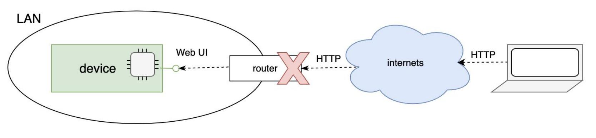
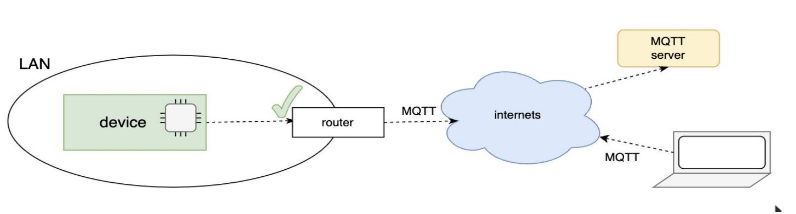
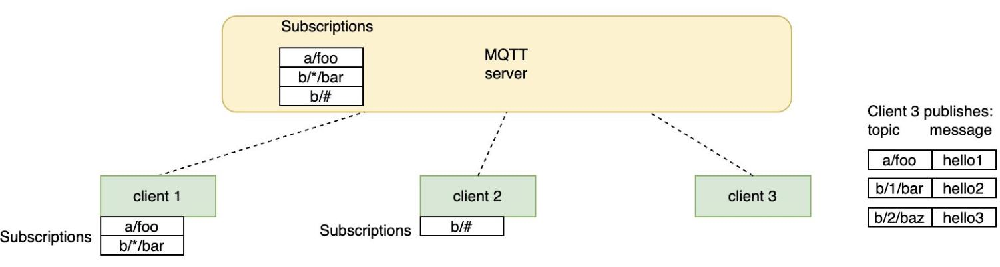
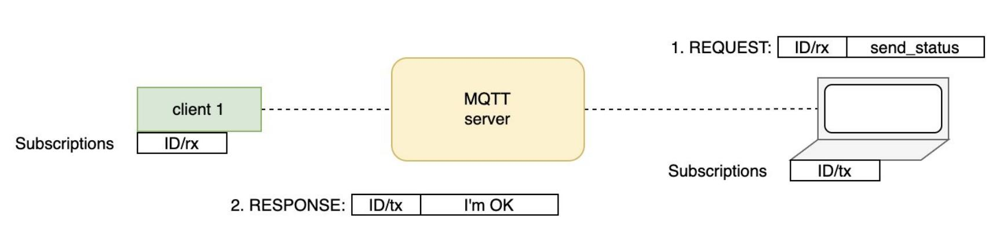

# MQTT basics

*Notes are based on the amazing tutorials/examples of the [Mongoose library](https://mongoose.ws/).*

- What's good about MQTT?  
    A great advantage is that it's more secure than an HTTP setup.  

    E.g. in the HTTP setup when you want
    want to control/inspect a device/sensor outside your LAN, you normally need to add an inbound traffic rule on the router sitting in the device's LAN, which is insecure:

    

    In MQTT you setup an intermediary server, exposed to the Internet. Then devices/operators make outbound connections to it. The server then dispatches client connections, allowing them to communicate with each other:

    

- MQTT 101

    MQTT implements publish/subscribe semantics: Any client can subscribe to a list of topics. Topics are just strings, with * and # working as wildcards. Any client can send messages: topic_name + data:

    

    Device control implies request/response semantics. Request/Response can be implemented with 2 topics: one for receiving commands, one for sending responses So a common setup is as follows:
    
